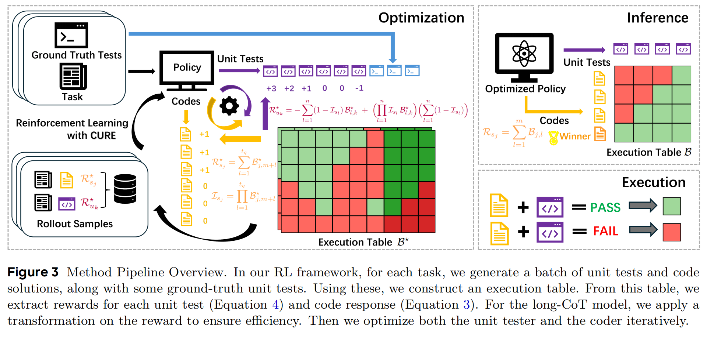
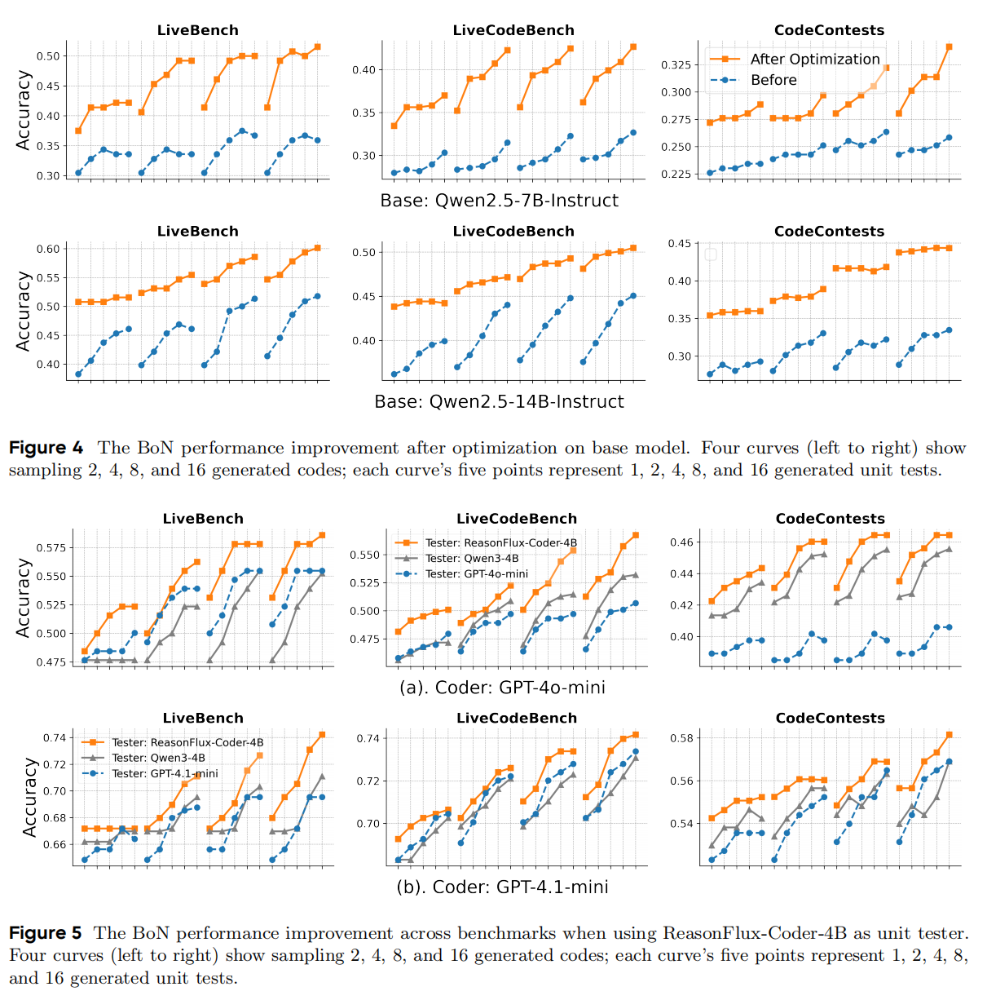

<h2 align="center">
  Co-Evolving LLM Coder and Unit Tester via Reinforcement Learning
</h2>

<p align="center">
  <a href="https://arxiv.org/abs/2506.03136">
    
  <a href="https://huggingface.co/collections/Gen-Verse/reasonflux-coder-6833109ed9300c62deb32c6b">
    
  </a>
  <a href="https://huggingface.co/collections/Gen-Verse/reasonflux-coder-6833109ed9300c62deb32c6b">
    
  </a>
  
</p>


<p align="center">
  
</p>

## 🌌 Introduction
We propose **CURE**, a novel reinforcement learning framework that co-evolves LLM coder and unit tester to improve the overall coding ability of large language models. Trained on just 4.5 K samples, our [ReasonFlux-Coder models](https://huggingface.co/collections/Gen-Verse/reasonflux-coder-6833109ed9300c62deb32c6b) outperform similarly sized Qwen Coder, DeepSeek Coder and Seed Coder. **Also, this is the first open-source Coding-RL project to make everything publicly available—including models, evaluation benchmarks, training and testing datasets, and training codes!**


## 📰 Latest Updates
* **[2025-06-03]** 🔥 We release a comprehensive evaluation benchmark and **six coding datasets to assess the overall coding ability of LLMs**, including one-shot coding, unit test generation, and Best-of-N evaluation. Both API-based and vLLM-based inference are supported. **You can easily evaluate your model!**
* **[2025-06-03]** 🔥 We release the training datasets and codes, organized into four modules—sampling, execution, reward assignment, and training. The code is **flexible to modify** or customize for your coding-RL-related projects.
* **[2025-06-03]** 🔥 We release our optimized models, [ReasonFlux-Coder-7B](https://huggingface.co/Gen-Verse/ReasonFlux-Coder-7B) and [ReasonFlux-Coder-14B](https://huggingface.co/Gen-Verse/ReasonFlux-Coder-14B), which outperform similarly sized Qwen Coders and DeepSeek Coders, and naturally fit into common test-time scaling and agentic coding pipelines. We also release our Long-CoT model [ReasonFlux-Coder-4B](https://huggingface.co/Gen-Verse/ReasonFlux-Coder-4B), outperforming Qwen3-4B while achieving 64.8% efficiency in unit test generation.

## 🧠 Methods

<p align="center">
  
</p>

<p align="center">
  
</p>

Our reinforcement learning framework co-evolves the LLM’s coding and unit-test generation abilities simultaneously, thereby improving its overall coding performance. As shown in the table above, after training on Qwen2.5-7B/14B-Instruct or Qwen3-4B, the models excel at one-shot coding, unit-test generation, and Best-of-N accuracy. Crucially, the unit tester requires no ground-truth code in the training data—it automatically learns from the coder’s mistakes during the RL rollout process.

The unit tester can be applied to test‐time scaling, agentic coding (iterative debugging and refinement), and even serve as a reward model for your coding LLM’s RL training (refer to our paper)!

## 🚀 Quick Start

```bash
conda create --name CURE python=3.10
source activate CURE
pip install torch
pip install -r requirements.txt
pip install --no-cache-dir \
  https://github.com/Dao-AILab/flash-attention/releases/download/v2.7.4.post1/\
flash_attn-2.7.4.post1+cu12torch2.6cxx11abiFALSE-cp310-cp310-linux_x86_64.whl
```

You can also install [FlashAttention](https://github.com/Dao-AILab/flash-attention) based on your version of PyTorch and CUDA.


## ⚙️ Download Dataset

We provide datasets in the Stdio format, including **CodeContests**, **LiveBench**, **LiveCodeBench**, **CodeForces**, and **MBPP**. You can also add your own evaluation dataset, detailed instructions are in `./data`.

Download the evaluation data `LiveBench` (can also choose `CodeContests`, `LiveCodeBench`, `CodeForces` and `MBPP`)
```bash
cd data
python download_dataset.py --dataset LiveBench
```

Download the training data `CodeContests_train`
```bash
cd data
python download_dataset.py --dataset CodeContests_train
```


## 📊 Comprehensive Evaluation

After downloading the dataset, you can perform a comprehensive evaluation using our benchmark, which includes **one-shot coding**, **unit test generation**, and **Best-of-N (BoN) evaluation**, supported by both API-based and vLLM-based inference. Detailed instructions are in `./evaluation`; you can modify `./evaluation/evaluation_config.py` then to evaluate your model's coding ability by `python eval.py`. We have two simple examples here:

* If you want to test an open-source model using vLLM (use_api=False), and evaluate both its coding accuracy and BoN accuracy (single_eval=False), simply run:
```bash
cd evaluation
python eval.py \
  --use_api False \
  --pretrained_model Qwen/Qwen2.5-7B-Instruct \
  --single_eval False \
  --dataset CodeContests \
  --k_code 4 \
  --k_case 4 \
  --scale_tuple_list "[(2, 2), (4, 4)]" \
  --gpu_groups "[[0,1],[2,3],[4,5],[6,7]]"
```
`pretrained_model` is the model to evaluate;

`dataset` is the evaluation dataset; 

`k_code` and `k_case` is the number of codes and unit tests the LLM generates to conduct BoN;

`scale_tuple_list` is the BoN setting list you want to report: (number of codes, number of unit tests);

`gpu_groups` is the GPU usage,  [[0]] represents only one engine with one GPU; [[0, 1], [2, 3]] represents two engines each with 2 GPUs, each engine loads a model to do inference concurrently.


* If you want to test a closed-source model using API (use_api=True), and only evaluate its coding accuracy (single_eval=True), simply run:
```bash
cd evaluation
python eval.py \
  --use_api True \
  --api_key API_KEY \
  --base_url BASE_URL \
  --api_model_name gpt-4o-mini \
  --single_eval True \
  --dataset CodeContests \
  --rpm_limit 100
```
`api_key` is your API key;

`base_url` is your base url;

`api_model_name` is the model to evaluate;

`dataset` is the evaluation dataset; 

`rpm_limit` the the request per minute you can set.


## 🔧 Training

To start training, simply set the configurations in `./optimization/optimization_config.py`, run the following command to CURE your coding model!
```bash
python run.py
```
See instructions about configuration details and how to monitor the results in `./optimization`.

## 🌱 Interesting Results

* our results show that the optimization leads to consistent and robust improvements across various BoN settings. This indicates that the ReasonFlux-Coder models not only enhance the overall performance ceiling (when large amounts of code and unit test samples are generated), but also improve self-check efficiency in low-sample regimes (e.g., when sampling only 1 or 2 candidates).
* We apply ReasonFlux-Coder-4B as the unit tester and evaluate its effect when paired with GPT-series models as coders, to disentangle the effects of the long-CoT coders’ strong coding ability from the unit test generation ability. We find that ReasonFlux-Coder-4B improves the BoN accuracy of both GPT-4o-mini and GPT-4.1-mini.
<p align="center">
  
</p>

* We apply ReasonFlux-Coder-4B to generate unit tests as supervision for reinforcement learning training on the Qwen2.5-14B-Instruct model. Surprisingly, the resulting performance improvements are comparable to those achieved using ground-truth labeled supervision, across all three metrics: code generation accuracy, unit test accuracy, and BoN accuracy. This demonstrates that ReasonFlux-Coder can serve as an effective reward model not only for inference-time enhancement but also for guiding optimization during training.
<p align="center">
  
</p>


## 📖 Citation
```
@article{wang2025cure,
  title={Co-Evolving LLM Coder and Unit Tester via Reinforcement Learning},
  author={Wang, Yinjie and Yang, Ling and Tian, Ye and Shen, Ke and Wang, Mengdi},
  journal={arXiv preprint arXiv:2506.03136},
  year={2025}
}
```

## 🤝 Acknowledgement

This code is heavily based on the amazing work of [Open-Reasoner-Zero](https://github.com/Open-Reasoner-Zero/Open-Reasoner-Zero/tree/main) and [OpenRLHF](https://github.com/OpenRLHF/OpenRLHF)!

## 💬 Discussion

Please do not hesitate to report any issues you encounter.


